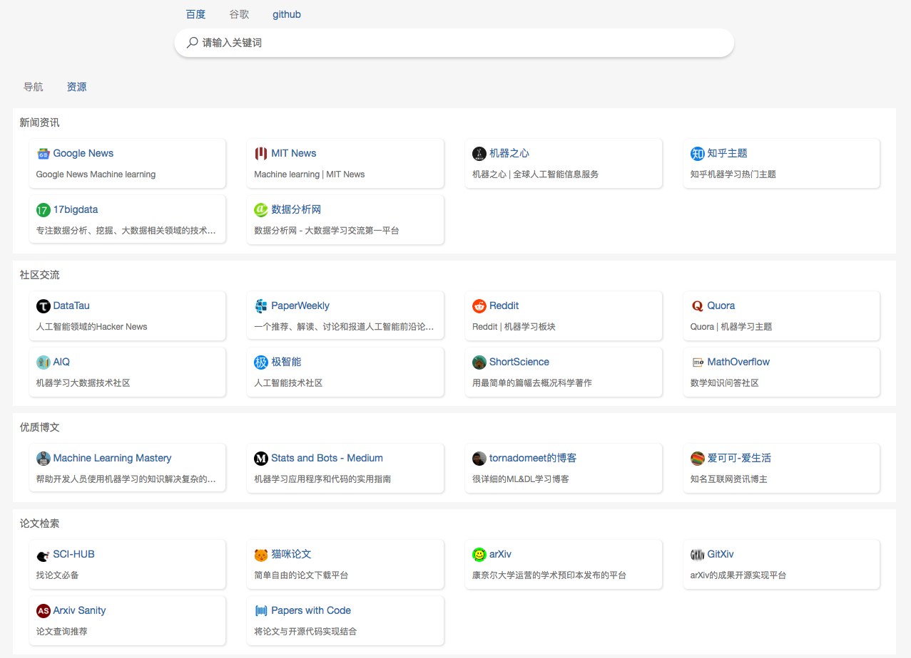

## Python3 入门机器学习 - 课程官方代码仓

大家好， 欢迎大家来到我在[慕课网](http://www.imooc.com/)上的实战课程[《Python3 入门机器学习》](https://coding.imooc.com/class/169.html)的官方代码仓。这个代码仓将不仅仅包含课程的所有源代码，还将发布课程的更新相关内容，勘误信息以及计划的更多可以丰富课程的内容，如更多分享，更多练习，等等等等。大家可以下载、运行、测试、修改。如果你发现了任何bug，或者对课程中的任何内容有意见或建议，欢迎和我联系：）

**个人网站**：[liuyubobobo.com](http://liuyubobobo.com)

**电子邮件**：[liuyubobobo@gmail.com](mailto:liuyubobobo@gmail.com)

**微博**: [刘宇波bobo http://weibo.com/liuyubobobo](http://weibo.com/liuyubobobo)

**知乎**: [刘宇波 http://www.zhihu.com/people/liuyubobobo](http://www.zhihu.com/people/liuyubobobo)

**知乎专栏：**[是不是很酷 https://zhuanlan.zhihu.com/liuyubobobo](https://zhuanlan.zhihu.com/liuyubobobo)

**个人公众号：是不是很酷**：）

推荐一下这门课程的同学 [**@howie6879**](https://github.com/howie6879) 倾情为大家制作的**机器学习资源导航检索站：[mlhub123](https://www.mlhub123.com/)**，欢迎大家围观使用支持：）传送门：[**https://www.mlhub123.com/**](https://www.mlhub123.com/) 大家有更多机器学习领域的开源资源，也可以在这个项目的github页面：[**howie6879/mlhub123**](https://github.com/howie6879/mlhub123) 提issue，给这个项目做贡献：）

## 课程源码目录 

| 第一章 欢迎来到 Python3 玩转机器学习 | 章节文件夹 | - |
| :--- | :---: | :---: |
| 1-1 什么是机器学习 | - | - |
| 1-2 课程涵盖的内容和理念 | - | - |
| 1-3 课程所使用的主要技术栈 | - | - |
| **第二章 机器学习基础** | [章节文件夹](02-Machine-Learning-Basics/)  | - |
| 2-1 机器学习世界的数据 | - | - |
| 2-2 机器学习的主要任务 | - | - |
| 2-3 监督学习，非监督学习，半监督学习和增强学习 | - | - |
| 2-4 批量学习，在线学习，参数学习和非参数学习 | - | - |
| 2-5 和机器学习相关的“哲学”思考 | - | - |
| 2-6 课程使用环境搭建 | [notebook](02-Machine-Learning-Basics/06-Development-Enviroment-Setup/06-Hello-Machine-Learning.ipynb) | [script](02-Machine-Learning-Basics/06-Development-Enviroment-Setup/myscript/main.py) |
| **第三章 Jupyter Notebook, Numpy和Matplotlib** | [章节文件夹](03-Jupyter-Notebook-Numpy-and-Matplotlib/) | - |
| 3-1 Jupyter Notebook基础 | [notebook](03-Jupyter-Notebook-Numpy-and-Matplotlib/01-Jupyter-Notebook-Basics/01-Jupyter-Notebook-Basics.ipynb) | - |
| 3-2 Jupyter Notebook中的魔法命令 | [notebook](03-Jupyter-Notebook-Numpy-and-Matplotlib/02-Magic-Commands/02-Magic-Commands.ipynb) | [script](03-Jupyter-Notebook-Numpy-and-Matplotlib/02-Magic-Commands/) |
| 3-3 Numpy数据基础 | [notebook](03-Jupyter-Notebook-Numpy-and-Matplotlib/03-Numpy-Array-Basics/03-Numpy-Array-Basics.ipynb) | - |
| 3-4 创建Numpy数组(和矩阵) | [notebook](03-Jupyter-Notebook-Numpy-and-Matplotlib/04-Create-Numpy-Array/04-Create-Numpy-Array.ipynb) | - |
| 3-5 Numpy数组(和矩阵)的基本操作 | [notebook](03-Jupyter-Notebook-Numpy-and-Matplotlib/05-Numpy-Array-Basic-Operations/05-Numpy-Array-Basic-Operations.ipynb) | - |
| 3-6 Numpy数组(和矩阵)的合并与分割 | [notebook](03-Jupyter-Notebook-Numpy-and-Matplotlib/06-Concatenate-and-Split/06-Concatenate-and-Split.ipynb) | - |
| 3-7 Numpy中的矩阵运算 | [notebook](03-Jupyter-Notebook-Numpy-and-Matplotlib/07-Computation-on-Numpy-Array/07-Computation-on-Numpy-Array.ipynb) | - |
| 3-8 Numpy中的聚合运算 | [notebook](03-Jupyter-Notebook-Numpy-and-Matplotlib/08-Aggregation-Operator-in-Numpy/08-Aggregation-Operator-in-Numpy.ipynb) | - |
| 3-9 Numpy中的arg运算 | [notebook](03-Jupyter-Notebook-Numpy-and-Matplotlib/09-Arg-Operation-in-Numpy/09-Arg-Operation-in-Numpy.ipynb) | - |
| 3-10 Numpy中的比较和Fancy Indexing | [notebook](03-Jupyter-Notebook-Numpy-and-Matplotlib/10-Comparison-and-Fancy-Indexing/10-Comparison-and-Fancy-Indexing.ipynb) | - |
| 3-11 Matplotlib数据可视化基础 | [notebook](03-Jupyter-Notebook-Numpy-and-Matplotlib/11-Matplotlib-Basics/11-Matplotlib-Basics.ipynb) | - |
| 3-12 数据加载和简单的数据探索 | [notebook](03-Jupyter-Notebook-Numpy-and-Matplotlib/12-Loading-Data-and-Simple-Data-Exploring/12-Loading-Data-and-Simple-Data-Exploring.ipynb) | - |
| 补充代码1: 更多Numpy的操作 | [notebook](03-Jupyter-Notebook-Numpy-and-Matplotlib/Optional-01-More-about-Numpy-Operations/Optional-01-More-about-Numpy-Operations.ipynb) | - |
| 补充代码2: Numpy中的结构数组 | [notebook](03-Jupyter-Notebook-Numpy-and-Matplotlib/Optional-02-Numpys-Structured-Arrays/Optional-02-Numpys-Structured-Arrays.ipynb) | - |
| 补充代码3: 简单的MNIST数据集数据探索 | [notebook](03-Jupyter-Notebook-Numpy-and-Matplotlib/Optional-03-MNIST-Simple-Data-Exploring/Optional-03-MNIST-Simple-Data-Exploring.ipynb) | - |
| **第四章 最基础的分类算法-k近邻算法 kNN** | [章节文件夹](04-kNN/) | - |
| 4-1 k近邻算法基础 | [notebook](04-kNN/01-kNN-Basics/01-kNN-Basics.ipynb) | - |
| 4-2 scikit-learn中的机器学习算法封装 | [notebook](04-kNN/02-kNN-in-scikit-learn/02-kNN-in-scikit-learn.ipynb) | [script](04-kNN/02-kNN-in-scikit-learn/) |
| 4-3 训练数据集，测试数据集 | [notebook](04-kNN/03-Test-Our-Algorithm/03-Test-Our-Algorithm.ipynb) | [playML](04-kNN/03-Test-Our-Algorithm/playML/) |
| 4-4 分类准确度 | [notebook](04-kNN/04-Accuracy-Score/04-Accuracy-Score.ipynb) | [playML](04-kNN/04-Accuracy-Score/playML/) |
| 4-5 超参数 | [notebook](04-kNN/05-Hyper-Parameters/05-Hyper-Parameters.ipynb) | - |
| 4-6 网格搜索与k近邻算法中更多超参数 | [notebook](04-kNN/06-More-Hyper-Parameters-in-kNN-and-Grid-Search/06-More-Hyper-Parameters-in-kNN-and-Grid-Search.ipynb) | - |
| 4-7 数据归一化 | [notebook](04-kNN/07-Feature-Scaling/07-Feature-Scaling.ipynb) | - | 
| 4-8 scikit-learn中的Scaler | [notebook](04-kNN/08-Scaler-in-Scikit-Learn/08-Scaler-in-Scikit-Learn.ipynb) | [playML](04-kNN/08-Scaler-in-Scikit-Learn/playML/) |
| 4-9 更多有关k近邻算法的思考 | - | - |
| 补充代码1: scikit-learn中的其他scaler | [整理中] | [敬请期待] |
| 补充代码2: 网格搜索kNN中的不同距离定义 | [整理中] | [敬请期待] |
| 补充代码3: 使用我们自己的kNN算法处理MNIST手写识别数据集 | [notebook](04-kNN/Optional-03-kNN-for-MNIST/Optional-03-kNN-for-MNIST.ipynb) | - |
| **第五章 线性回归法** | [章节文件夹](05-Linear-Regression/) | |
| 5-1 简单线性回归 | - | - |
| 5-2 最小二乘法 | - | - |
| 5-3 简单线性回归的实现 | [notebook](05-Linear-Regression/03-Simple-Linear-Regression-Implementation/03-Simple-Linear-Regression-Implementation.ipynb) | [playML](05-Linear-Regression/03-Simple-Linear-Regression-Implementation/playML/) |
| 5-4 向量化 | [notebook](05-Linear-Regression/04-Vectorization/04-Vectorization.ipynb) | [playML](05-Linear-Regression/04-Vectorization/playML/) |
| 5-5 衡量线性回归法的指标：MSE，RMSE和MAE | [notebook](05-Linear-Regression/05-Regression-Metrics-MSE-vs-MAE/05-Regression-Metrics-MSE-vs-MAE.ipynb) | [playML](05-Linear-Regression/05-Regression-Metrics-MSE-vs-MAE/playML/) |
| 5-6 最好的衡量线性回归法的指标：R Squared | [notebook](05-Linear-Regression/06-R-Squared/06-R-Squared.ipynb) | [playML](05-Linear-Regression/06-R-Squared/playML/) |
| 5-7 多元线性回归和正规方程解 | - | - |
| 5-8 实现多元线性回归 | [notebook](05-Linear-Regression/08-Our-Linear-Regression/08-Our-Linear-Regression.ipynb) | [playML](05-Linear-Regression/08-Our-Linear-Regression/playML/) |
| 5-9 使用scikit-learn解决回归问题 | [notebook](05-Linear-Regression/09-Regression-in-scikit-learn/09-Regression-in-scikit-learn.ipynb) | [playML](05-Linear-Regression/09-Regression-in-scikit-learn/playML/) |
| 5-10 线性回归的可解释性和更多思考 | [notebook](05-Linear-Regression/10-More-about-Linear-Regression/10-More-about-Linear-Regression.ipynb) | - |
| 补充代码1: 分类变量的处理 | [整理中] | [敬请期待] |
| 补充代码2: scikit-learn中同时处理数字变量和分类变量 | [整理中] | [敬请期待] |
| 补充代码3: FeatureUnion的使用 | [整理中] | [敬请期待] |
| **第六章 梯度下降法** | [章节文件夹](06-Gradient-Descent/) | - |
| 6-1 什么是梯度下降法 | - | - |
| 6-2 模拟实现梯度下降法 | [notebook](06-Gradient-Descent/02-Gradient-Descent-Simulations/02-Gradient-Descent-Simulations.ipynb) | - |
| 6-3 线性回归中的梯度下降法 | - | - |
| 6-4 实现线性回归中的梯度下降法 | [notebook](06-Gradient-Descent/04-Implement-Gradient-Descent-in-Linear-Regression/04-Implement-Gradient-Descent-in-Linear-Regression.ipynb) | [playML](06-Gradient-Descent/04-Implement-Gradient-Descent-in-Linear-Regression/playML/) |
| 6-5 梯度下降法的向量化和数据标准化 | [notebook](06-Gradient-Descent/05-Vectorize-Gradient-Descent/05-Vectorize-Gradient-Descent.ipynb) | [playML](06-Gradient-Descent/05-Vectorize-Gradient-Descent/playML/) |
| 6-6 随机梯度下降法 | [notebook](06-Gradient-Descent/06-Stochastic-Gradient-Descent/06-Stochastic-Gradient-Descent.ipynb) | - |
| 6-7 scikit-learn中的随机梯度下降法 | [notebook](06-Gradient-Descent/07-SGD-in-scikit-learn/07-SGD-in-scikit-learn.ipynb) | [playML](06-Gradient-Descent/07-SGD-in-scikit-learn/playML/) |
| 6-8 如何确定梯度计算的准确性？调试梯度下降法 | [notebook](06-Gradient-Descent/08-Debug-Gradient/08-Debug-Gradient.ipynb) | - |
| 6-9 有关梯度下降法的更多深入讨论 | - | - |
| 补充代码1: 实现小批量梯度下降法 | [整理中] | [敬请期待] |
| 补充代码2: 三种梯度下降法的可视化比较 | [整理中] | [敬请期待] |
| **第七章 PCA与梯度上升法** | [章节文件夹](07-PCA-and-Gradient-Ascent/) | - |
| 7-1 什么是PCA | - | - |
| 7-2 使用梯度上升法求解PCA问题 | - | - |
| 7-3 求数据的主成分 | [notebook](07-PCA-and-Gradient-Ascent/03-Implement-PCA-in-BGA/03-Implement-PCA-in-BGA.ipynb) | - |
| 7-4 求数据的前n个主成分 | [notebook](07-PCA-and-Gradient-Ascent/04-Getting-First-N-Components/04-Getting-First-n-Components.ipynb) | - |
| 7-5 高维数据映射为低维数据 | [notebook](07-PCA-and-Gradient-Ascent/05-Data-Projection/05-Data-Projection.ipynb) | [playML](07-PCA-and-Gradient-Ascent/05-Data-Projection/playML/) |
| 7-6 scikit-learn中的PCA | [notebook](07-PCA-and-Gradient-Ascent/06-PCA-in-scikit-learn/06-PCA-in-scikit-learn.ipynb) | - |
| 7-7 试手MNIST数据集 | [notebook](07-PCA-and-Gradient-Ascent/07-MNIST/07-MNIST.ipynb) | - |
| 7-8 使用PCA对数据进行降噪 | [notebook](07-PCA-and-Gradient-Ascent/08-PCA-for-Noise-Reduction/08-PCA-for-Noise-Reduction.ipynb) | - |
| 7-9 人脸识别与特征脸 | [notebook](07-PCA-and-Gradient-Ascent/09-Eigenface/09-Eigenface.ipynb) | - |
| 补充代码1: 可视化三维数据的PCA过程 | [notebook](07-PCA-and-Gradient-Ascent/Optional-01-PCA-in-3d-Data/Optional-01-PCA-in-3d-Data.ipynb) | - |
| 补充代码2: IPCA | [整理中] | [敬请期待] |
| 补充代码3: 随机化PCA | [整理中] | [敬请期待] |
| 补充代码4: Kernel PCA | [整理中] | [敬请期待] |
| 补充代码5: LLE | [整理中] | [敬请期待] |
| 补充代码6: 更多降维方法 | [整理中] | [敬请期待] |
| **第八章 多项式回归与模型泛化** | [章节文件夹](08-Polynomial-Regression-and-Model-Generalization/) | - |
| 8-1 什么是多项式回归 | [notebook](08-Polynomial-Regression-and-Model-Generalization/01-What-is-Polynomial-Regression/01-What-is-Polynomial-Regression.ipynb) | - |
| 8-2 scikit-learn中的多项式回归与Pipeline | [notebook](08-Polynomial-Regression-and-Model-Generalization/02-Polynomial-Regression-in-scikit-learn/02-Polynomial-Regression-in-scikit-learn.ipynb) | - |
| 8-3 过拟合与欠拟合 | [notebook](08-Polynomial-Regression-and-Model-Generalization/03-Overfitting-and-Underfitting/03-Overfitting-and-Underfitting.ipynb) | - |
| 8-4 为什么要有训练数据集与测试数据集 | [notebook](08-Polynomial-Regression-and-Model-Generalization/04-Why-Train-Test-Split/04-Why-Train-Test-Split.ipynb) | - |
| 8-5 学习曲线 | [notebook](08-Polynomial-Regression-and-Model-Generalization/05-Learning-Curve/05-Learning-Curve.ipynb) | - |
| 8-6 验证数据集与交叉验证 | [notebook](08-Polynomial-Regression-and-Model-Generalization/06-Validation-and-Cross-Validation/06-Validation-and-Cross-Validation.ipynb) | - |
| 8-7 偏差方差平衡 | - | - |
| 8-8 模型泛化与岭回归 | [notebook](08-Polynomial-Regression-and-Model-Generalization/08-Model-Regularization-and-Ridge-Regression/08-Model-Regularization-and-Ridge-Regression.ipynb) | - |
| 8-9 LASSO | [notebook](08-Polynomial-Regression-and-Model-Generalization/09-LASSO-Regression/09-LASSO-Regression.ipynb) | - |
| 8-10 L1, L2和弹性网络 | - | - |
| 补充代码1: scikit-learn中的学习曲线 | [整理中] | [敬请期待] |
| 补充代码2: 更多scikit-learn中的交叉验证 | [整理中] | [敬请期待] |
| 补充代码3: scikit-learn中的Elastic Net | [整理中] | [敬请期待] |
| **第九章 逻辑回归** | [章节文件夹](09-Logistic-Regression/) | - |
| 9-1 什么是逻辑回归 | [notebook](09-Logistic-Regression/01-What-is-Logistic-Regression/01-What-is-Logistic-Regression.ipynb) | - |
| 9-2 逻辑回归的损失函数 | - | - |
| 9-3 逻辑回归损失函数的梯度 | - | - |
| 9-4 实现逻辑回归算法 | [notebook](09-Logistic-Regression/04-Implement-Logistic-Regression/04-Implement-Logistic-Regression.ipynb) | [playML](09-Logistic-Regression/04-Implement-Logistic-Regression/playML/) |
| 9-5 决策边界 | [notebook](09-Logistic-Regression/05-Decision-Boundary/05-Decision-Boundary.ipynb) | [playML](09-Logistic-Regression/05-Decision-Boundary/playML/) |
| 9-6 在逻辑回归中使用多项式特征 | [notebook](09-Logistic-Regression/06-Polynomial-Features-in-Logistic-Regression/06-Polynomial-Features-in-Logistic-Regression.ipynb) | [playML](09-Logistic-Regression/06-Polynomial-Features-in-Logistic-Regression/playML/) |
| 9-7 scikit-learn中的逻辑回归 | [notebook](09-Logistic-Regression/07-Logistic-Regression-in-scikit-learn/07-Logistic-Regression-in-scikit-learn.ipynb) | - |
| 9-8 OvR与OvO | [notebook](09-Logistic-Regression/08-OVR-and-OVO/08-OVR-and-OVO.ipynb) | - |
| 补充代码1: kNN的决策边界 | [notebook](09-Logistic-Regression/Optional-01-kNN-Decision-Boundary/Optional-01-kNN-Decision-Boundary.ipynb) | - |
| 补充代码2: scikit-learn中的LogisticRegressionCV | [notebook](09-Logistic-Regression/Optional-02-LogisticRegressionCV/Optional-02-LogisticRegressionCV.ipynb) | - |
| 补充代码3: scikit-learn中随机梯度下降法训练逻辑回归 | [整理中] | [敬请期待] |
| **第十章 分类算法的评价** | [章节文件夹](10-Classification-Performance-Measures/) | - |
| 10-1 准确度的陷阱和混淆矩阵 | - | - |
| 10-2 精准率和召回率 | - | - |
| 10-3 实现混淆矩阵，精准率和召回率 | [notebook](10-Classification-Performance-Measures/03-Implement-Confusion-Matrix-Precision-and-Recall/03-Implement-Confusion-Matrix-Precision-and-Recall.ipynb) | - |
| 10-4 F1 Score | [notebook](10-Classification-Performance-Measures/04-F1-Score/04-F1-Score.ipynb) | - |
| 10-5 精准率和召回率的平衡 | [notebook](10-Classification-Performance-Measures/05-Precision-Recall-Tradeoff/05-Precision-Recall-Tradeoff.ipynb) | - |
| 10-6 精准率-召回率曲线 | [notebook](10-Classification-Performance-Measures/06-Precision-Recall-Curve/06-Precision-Recall-Curve.ipynb) | - |
| 10-7 ROC曲线 | [notebook](10-Classification-Performance-Measures/07-ROC-Curve/07-ROC-Curve.ipynb) | [playML](10-Classification-Performance-Measures/07-ROC-Curve/playML/) |
| 10-8 多分类问题中的混淆矩阵 | [notebook](10-Classification-Performance-Measures/08-Confusion-Matrix-in-Multiclass-Classification/08-Confusion-Matrix-in-Multiclass-Classification.ipynb) | - |
| 补充代码1: Precision-Recall曲线的面积 | [整理中] | [敬请期待] |
| 补充代码2: 多分类问题下的各项指标 | [整理中] | [敬请期待] |
| **第十一章 支撑向量机SVM** | [章节文件夹](11-SVM/) | - |
| 11-1 什么是SVM | - | - |
| 11-2 SVM背后的最优化问题 | - | - | 
| 11-3 Soft Margin SVM | - | - |
| 11-4 scikit-learn中的SVM | [notebook](11-SVM/04-SVM-in-scikit-learn/04-SVM-in-scikit-learn.ipynb) | - |
| 11-5 SVM中使用多项式特征和核函数 | [notebook](11-SVM/05-Polynomial-Features-in-SVM-and-Kernel-Function/05-Polynomial-Features-in-SVM-and-Kernel-Function.ipynb) | - |
| 11-6 到底什么是核函数 | - | - |
| 11-7 什么是RBF核 | [notebook](11-SVM/07-What-is-RBF-Kernel/07-What-is-RBF-Kernel.ipynb) | - |
| 11-8 scikit-learn中使用RBF核 | [notebook](11-SVM/08-RBF-Kernel-in-scikit-learn/08-RBF-Kernel-in-scikit-learn.ipynb) | - |
| 11-9 SVM思想解决回归问题 | [notebook](11-SVM/09-SVM-Regressor/09-SVM-Regressor.ipynb) | - |
| 补充代码1: SVR调参解决波士顿房价问题 | [整理中] | [敬请期待] |
| 补充代码2: 更多SVM核函数 | [整理中] | [敬请期待] |
| 补充代码3: 手撕LinearSVC | [整理中] | [敬请期待] |
| 补充代码4: 在PCA中使用Kernel——Kernel PCA | [整理中] | [敬请期待] |
| **第十二章 决策树** | [章节文件夹](12-Decision-Tree/) | - |
| 12-1 什么是决策树 | [notebook](12-Decision-Tree/01-What-is-Decision-Tree/01-What-is-Decision-Tree.ipynb) | - |
| 12-2 信息熵 | [notebook](12-Decision-Tree/02-Entropy/02-Entropy.ipynb) | - |
| 12-3 使用信息熵寻找最优划分 | [notebook](12-Decision-Tree/03-Entropy-Split-Simulation/03-Entropy-Split-Simulation.ipynb) | - |
| 12-4 基尼系数 | [notebook](12-Decision-Tree/04-Gini-Index/04-Gini-Index.ipynb) | - |
| 12-5 CART与决策树中的超参数 | [notebook](12-Decision-Tree/05-CART-and-Decision-Tree-Hyperparameters/05-CART-and-Decision-Tree-Hyperparameters.ipynb) | - |
| 12-6 决策树解决回归问题 | [notebook](12-Decision-Tree/06-Decision-Tree-Regressor/06-Decision-Tree-Regressor.ipynb) | - |
| 12-7 决策树的局限性 | [notebook](12-Decision-Tree/07-Problems-of-Decision-Tree/07-Problems-of-Decision-Tree.ipynb) | - |
| 补充代码1: 决策树看学习曲线 | [notebook](12-Decision-Tree/Optional-01-Learning-Curve-for-Decision-Tree/Optional-01-Learning-Curve-for-Decision-Tree.ipynb) | - |
| 补充代码2: 决策树看复杂度曲线 | [notebook](12-Decision-Tree/Optional-02-Model-Complexity-Curve-for-Decision-Tree/Optional-02-Model-Complexity-Curve-for-Decision-Tree.ipynb) | - |
| 补充代码3: 决策树调参解决波士顿房价问题 | [整理中] | [敬请期待] |
| 补充代码4: 手撕决策树 | [整理中] | [敬请期待] |
| **第十三章 集成学习和随机森林** | [章节文件夹](13-Ensemble-Learning-and-Random-Forest/) | - |
| 13-1 什么是集成学习 | [notebook](13-Ensemble-Learning-and-Random-Forest/01-What-is-Ensemble-Learning/01-What-is-Ensemble-Learning.ipynb) | - |
| 13-2 Soft Voting Classifier | [notebook](13-Ensemble-Learning-and-Random-Forest/02-Soft-Voting-Classifier/02-Soft-Voting-Classifier.ipynb) | - |
| 13-3 Bagging 和 Pasting | [notebook](13-Ensemble-Learning-and-Random-Forest/03-Bagging-and-Pasting/03-Bagging-and-Pasting.ipynb) | - |
| 13-4 oob (Out-of-Bag) 和关于Bagging的更多讨论 | [notebook](13-Ensemble-Learning-and-Random-Forest/04-OOB-and-More-about-Bagging-Classifier/04-OOB-and-More-About-Bagging-Classifier.ipynb) | - |
| 13-5 随机森林和 Extra-Trees | [notebook](13-Ensemble-Learning-and-Random-Forest/05-Random-Forest-and-Extra-Trees/05-Random-Forest-and-Extra-Trees.ipynb) | - |
| 13-6 Ada Boosting 和 Gradient Boosting | [notebook](13-Ensemble-Learning-and-Random-Forest/06-AdaBoost-and-Gradient-Boosting/06-AdaBoost-and-Gradient-Boosting.ipynb) | - |
| 13-7 Stacking | - | - |
| 补充代码1: 使用随机森林判断特征重要程度 | [整理中] | [敬请期待] |
| 补充代码2: 调参使用Bagging | [整理中] | [敬请期待] |
| 补充代码3: 调参使用RandomForests | [整理中] | [敬请期待] |
| 补充代码4: 调参使用Extra-Trees | [整理中] | [敬请期待] |
| 补充代码5: 调参使用AdaBoost | [整理中] | [敬请期待] |
| 补充代码6: 调参使用Gradient Boosting | [整理中] | [敬请期待] |
| 补充代码7: 手撕Stacking | [整理中] | [敬请期待] |
| **第十四章 结语，大家加油！** | - | - |
| 14-1 学习scikit-learn文档, 大家加油！ | - | - |

## 课程补充内容

除了上面课程目录中每个章节相应有一些课程的补充代码以外，这个课程在我最初设计的时候，比现在所呈现的样子要多一些（其实是很多...）内容。由于慕课网上的课程时间限制，所以不能完全以视频课程的形式展现出来。另外砍掉这部分内容，还有一个原因，是这部分内容，大多可以在慕课网上的其他课程上找到。不过，在这里，为了保持我的这个课程的完整性，我将这些内容以notebook的形式放在这个代码仓中，供感兴趣的同学参考：）

| **补充章节一 Pandas** | [章节文件夹](Optional-01-Using-Pandas/) | - |
| :--- | :---: | :---: |
|  |  |  |
| **补充章节二 Matplotlib** | [整理中] | [敬请期待] |
|  |  |  |
| **补充章节三 朴素的贝叶斯算法** | [整理中] | [敬请期待] |
|  |  |  |
| **补充章节四 神经网络** | [整理中] | [敬请期待] |
|  |  |  |
| **补充章节五 Kaggle案例** | [整理中] | [敬请期待] |
|  |  |  |

---

**课程讲义的PDF版本不在github上提供**，大家可以在慕课网上 "下载 -> 查看讲师源码" 中各个章节文件夹下找到。

**大家加油！：）**